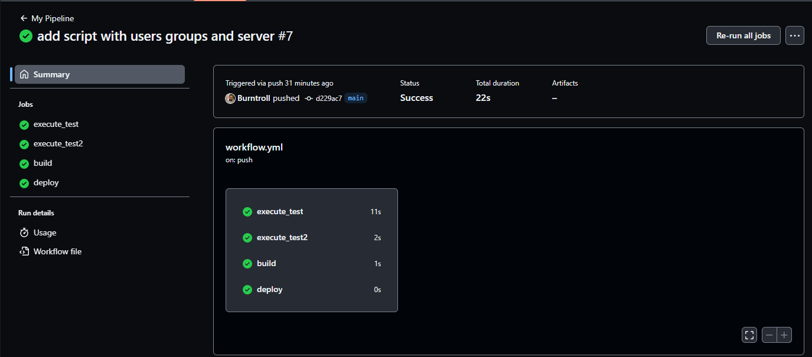

# Ubuntu System Setup and Pipeline

This Ubuntu System Setup and Testing is a project designed to create and test a basic Ubuntu system with user and file management functionalities. The project consists of a bash script that creates user groups, directories with specific access permissions, and users with password management. It also includes a GitHub Actions workflow to test the script in a Ubuntu environment.

## Features

- Creation of user groups with specific permissions
- Creation of directories with specific access permissions
- User management with password management
- GitHub Actions workflow to test the script in a Ubuntu environment

## Technologies Used

- Bash: Used to write the script for user and file management
- GitHub Actions: Used to automate the testing process and ensure the script works in a Ubuntu environment.

## Contributing

Contributions to this project are welcome! Feel free to fork this repository and submit a pull request with your changes.

## Credits

This project was built by [Francisco Silva](https://github.com/Burntroll).

## License

This project is licensed under the [MIT License](https://opensource.org/licenses/MIT).

## Pipeline

.

